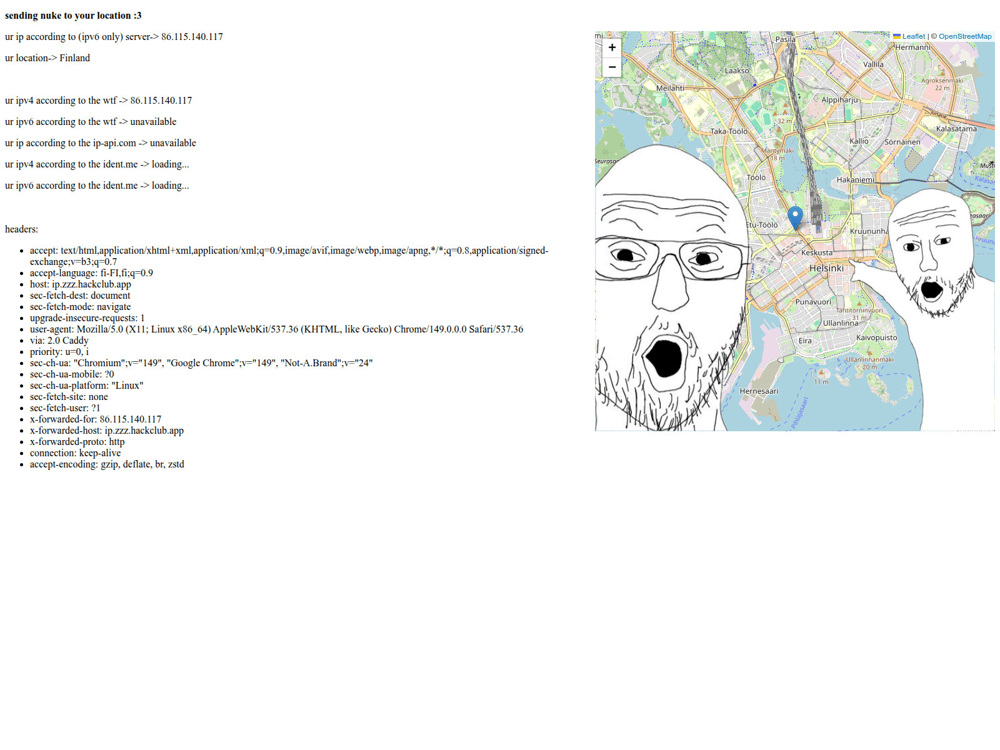

# infoprinty
 
we printy info about u \
tl;dr we printy your ip address for mastor haxxor \
that's it
## screenshot

## tech stack
* python
* fastapi
* GeoLite2

## todo:
* more fingerprinting
* popups
* torrent checker
* print asns
* browser info
* camera/microphone/geo/downloads stuff
* super nuke location computer
* master haxxor theme

## databases taken from here:
https://github.com/P3TERX/GeoLite.mmdb/releases/download/2026.06.25/GeoLite2-City.mmdb
https://github.com/P3TERX/GeoLite.mmdb/releases/download/2026.06.25/GeoLite2-ASN.mmdb

## ai usage
* ai was used to do things i didn't want to do
* ai did a few chores, mostly guided by me
* unfortunately i was lazy for the js part so amp helped do that